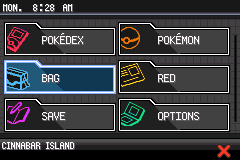
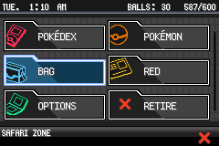
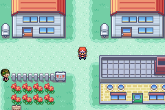
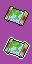

# 👀 What is this? 
A custom start menu for Fire Red.
Normal: <br> 
 <br>
Safari Zone: <br> 
 <br>
## ✨ Features
- BW styled UI
- Configurable to add more than 6 default options.

# ❓ How to use?
Same as CFRU, `python 3.6+` and `devkitARM` are required to compile.<br>

### 💾  Adding your rom  
Copy your rom to this directory and rename it to `BPRE0.gba`

### ⚙️ Configuration 
**Compile Time Constants** <br>
Open [scripts/make.py](https://github.com/ansh860/start-menu/blob/bw/scripts/make.py#L12) in a text editor to set some compile-time configuration.
The build system is smart enough to find enough free space on its own, and if you want it to be inserted at a particular address, you can specify it by updating the definition of `OFFSET_TO_PUT`:

```python
OFFSET_TO_PUT = 0x1C88650
SEARCH_FREE_SPACE = True   # Set to True if you want the script to search for free space
                           # Set to False if you don't want to search for free space as you for example update the engine
```

The build system will use `OFFSET_TO_PUT` to determine where in the ROM it should start looking for free space if `SEARCH_FREE_SPACE` is `True`.  Otherwise, the build system places the code to insert directly at `OFFSET_TO_PUT`.

### 🛠️ Building The Project
Once you are ready run:
```shell
$ python scripts/make.py
```
The code will start compiling, and generate a output rom `test.gba` in same directory.
Naturally, test it in an emulator.

### ➕ Adding New Options To Start Menu
New options can be added to the start menu. Let's try to add this town map option for instance. <br>
 <br>
#### 🖼️ Step 1 : Defining the gfx data for start menu option icon

The icon should be 32x32, 16 colors sprite with 2 frames. For Town Map, we'll be taking this icon. <br>
↶ First Frame: When Town Map is Unselected <br>
 ← Second Frame: When Town Map is currently selected in start menu <br> 


Now, having the icon `TownMap.png` ready, indexed to 16 colors, move it to `graphics/sprites`. 
Next declare the gfx data in `src/graphics.h` like this:
````c
. . .
// Town Map Gfx Data
extern const u8 TownMapTiles[];
extern const u16 TownMapPal[];
. . .
````

<details> 
   <summary>Note: Rules for declaring the gfx data </summary>
    The Format for declaring the gfx data is:

````c
extern u8 [FILNAME]Tiles[];
extern u16 [FILENAME]Pal[];
````
Here `[FILENAME]` is the name of your icon image file(without extension).
For example, if your icon image file name is `TownMap.png` then `[FILENAME]` = TownMap and the data would be declared as follows:

````c
extern u8 TownMapTiles[];
extern u16 TownMapPal[];
````

</details>

#### 🗨️ Step 2: Defining the text 

Now, we'll want to have a name of our option which will be displayed in start menu list.
Open  `strings/start_menu.string` and add the name of the option at the end of the file.
For Town Map we'll do as follows:
````
#org @gText_TownMap 
Town Map
````
`gText_TownMap` is the label for the text data (you can choose anything for your option).
Now, open `include/start_menu.h` and add this lines at suitable line:
````c
extern u8 gText_TownMap[];
````
#### Step 3: Defining the function of the option

We need to define what will it do when the option is used. 
Now, there are two ways this can be done, first, through functions and second, through script.
#### Functions
For this, we need to define a function which will trigger all the action when A button is clicked while the option is currently selected.
You can either write your own function to get the job done or just use some function from fire red which can get your job done.
For Town Map we'll be using this function defining it in `src/start_menu.c`:
````c
static void ShowTownMap(void) {
    QuestLog_CutRecording();
    InitRegionMapWithExitCB(REGIONMAP_TYPE_WALL, CB2_ReturnToFieldWithOpenMenu);
}

````
Also remember to add a static declaration of this function at start of the code after the includes.
````c
static void ShowTownMap(void);
````

<details>
     <summary> Using pre-defined functions from fire red rom (Check if you don't know) </summary>
     For using a pre-defined function from the rom, you'll require to declare the function(no definition require) and the address(same thing we use with callasm to call a function/asm) of the function in the rom. <br>

1) Now as long as your function does not take any parameters and does not return anything, find it and declare it any  header file which is included in `src/start_menu.c`.

````c
extern void func(void);
````
2) Now define the address of the `func` in `BPRE.ld`.
````
func = 0xXXXXXXX|1;
````
If we were to use the predefined function for the town map option we could use `ShowTownMap` function located at `0x80ca7ec` in fire red.
Therefore, in `include/start_menu.h:
````c
extern void ShowTownMap(void);
````
And, in `BPRE.ld`:
````
...
ShowTownMap = 0x80ca7ec|1;
````
</details>

#### Scripts 
We can also add functionality to the options using the scripts.
1) First, write your script in `asesembly/script.s`.

````
.global Script_Name

Script_Name:
    @ script here 
````
2) After writing the script, declare it in `include/start_menu.h` at suitable line:
````c
extern u8 Script_Name[];
````
Note: When scripts are used, it first go to overworld and then script is launched.

Now, if script were to used for the town map option:

1) In `assembly/script.s`:

````s
.global Script_TownMap

Script_TownMap:
    special 0xFB
    waitstate
    end
````

#### 📊 Step 4: Adding entries to data structures
Now, we need to fill up some structs and enums in order to make it work.
#### Enums
1) Open `src/graphics.h` and find there the `enum GfxTags` and add an entry to at end of it, for town map we'll be using `GFXTAG_TOWNMAP`.

````c
enum GfxTags
{
        GFXTAG_PANEL,
        GFXTAG_EXIT,
        GFXTAG_POKEDEX,
        GFXTAG_POKEMON,
        GFXTAG_BAG,
        GFXTAG_PLAYER,
        GFXTAG_SAVE,
        GFXTAG_OPTIONS,
        GFXTAG_SCROLLBAR,
        GFXTAG_RETIRE,
        GFXTAG_TOWNMAP,
};

````

2) Open `include/start_menu.h` and find `enum StartMenuOptions` and add an entry of name of your choice, just before the `MAX_STARTMENU_ITEMS`. For Town Map, we'll be using `STARTMENU_TOWNMAP`.

````c
enum StartMenuOptions
{
        STARTMENU_POKEDEX = 0,
        STARTMENU_POKEMON,
        STARTMENU_BAG,
        STARTMENU_PLAYER, 
        STARTMENU_SAVE,
        STARTMENU_OPTION,
        STARTMENU_RETIRE,
        STARTMENU_TOWNMAP,
        MAX_STARTMENU_ITEMS
};
````

#### Structures/Tables 

1. Open `include/start-menu.h` and find `StartMenuIconTable`, here the important data related to icons is stored to access from. 
At the end of it add an entry for your option.

````c
static struct StartMenuIcon StartMenuIconTable[] = 
{
  [STARTMENU_POKEDEX] = 
  {
    .spritesheet = {pokedexTiles, 32*32, GFXTAG_POKEDEX},
    .spritepalette =  {pokedexPal, GFXTAG_POKEDEX},
    .sprtemplate = icon_template(GFXTAG_POKEDEX)
  },
  [STARTMENU_POKEMON] = 
  {
    .spritesheet = {pokemonTiles, 32*32, GFXTAG_POKEMON},
    .spritepalette = {pokemonPal, GFXTAG_POKEMON},
    .sprtemplate = icon_template(GFXTAG_POKEMON)
  },
  [STARTMENU_BAG] =
  {
    .spritesheet = {bagTiles, 32*32, GFXTAG_BAG},
    .spritepalette = {bagPal, GFXTAG_BAG},
    .sprtemplate = icon_template(GFXTAG_BAG)
  },
  [STARTMENU_PLAYER] =
  {
    .spritesheet = {playerTiles, 32*32, GFXTAG_PLAYER},
    .spritepalette = {playerPal, GFXTAG_PLAYER},
    .sprtemplate = icon_template(GFXTAG_PLAYER)
  },
  [STARTMENU_SAVE] =
  {
    .spritesheet = {saveTiles, 32*32, GFXTAG_SAVE},
    .spritepalette = {savePal, GFXTAG_SAVE},
    .sprtemplate = icon_template(GFXTAG_SAVE)
  },
  [STARTMENU_OPTION] =
  {
    .spritesheet = {optionsTiles, 32*32, GFXTAG_OPTIONS},
    .spritepalette = {optionsPal, GFXTAG_OPTIONS},
    .sprtemplate = icon_template(GFXTAG_OPTIONS)
  },
  [STARTMENU_RETIRE] =
  {
    .spritesheet = {exitTiles, 16*16 , GFXTAG_RETIRE},
    .spritepalette = {exitPal, GFXTAG_RETIRE},
    .sprtemplate =
     {
        .tileTag = GFXTAG_RETIRE,
        .paletteTag = GFXTAG_RETIRE,
        .oam = &sExitIconOam,
        .anims = sAnimCmdTable_Exit,
        .images = NULL,
        .affineAnims = gDummySpriteAffineAnimTable,
        .callback = PanelCallBack,  
     },
  },
  [STARTMENU_TOWNMAP] = 
  {
    .spritesheet = {TownMapTiles, 32*32, GFXTAG_TOWNMAP},
    .spritepalette = {TownMapPal, GFXTAG_TOWNMAP},
    .sprtemplate = icon_template(GFXTAG_TOWNMAP)
  }
};
````

2. Open `src/start_menu.c` and find and add an entry for your option.

<details> 
     <summary> Filling out the struct for the option </summary> 

`sStartMenuOptions` is a table of `struct StartMenuOption` which has the following members:

````c
struct StartMenuOption 
{
  u8 id;
  u8 * text;
  u16 flag; 
  u8 * script;
  void (*func);
};
````
- **id**: This is the option id, should be the same one as filled in `enum StartMenuOPtions`.
- **text**: It holds the pointer to the text for the option.
- **flag**: The flag which should be set for the option to appear in start menu list. Set to 0 if option should appear in start menu always.
- **script**: The script to use as the option's function. Set to NULL if a function is used.
- **func**: The function to use when option is used. Set to NULL if a script is used instead.
Please refer to the other options' entry in the table for example.
</details>

````c
static const struct StartMenuOption sStartMenuOptionsTable[] = 
{
  {
    .id =  STARTMENU_POKEDEX,
    .text = (u8*) gText_StartMenu_Pokedex,
    .flag = FLAG_SYS_POKEDEX_GET,
    .script = NULL,
    .func = CB2_OpenPokedexFromStartMenu
  },
  {
    .id =  STARTMENU_POKEMON,
    .text =  (u8*) gText_StartMenu_Pokemon,
    .flag =  FLAG_SYS_POKEMON_GET,
    .script =  NULL,
    .func = CB2_PartyMenuFromStartMenu
  },
  {
    .id =  STARTMENU_BAG,
    .text =  (u8*) gText_StartMenu_Bag,
    .flag = 0, 
    .script =  NULL,
    .func = CB2_BagMenuFromStartMenu
  },
  {
    .id =  STARTMENU_PLAYER, 
    .text = NULL,     // [PLAYER] doesn't work for reason 
    .flag =  0, 
    .script = NULL,
    .func = CB2_PlayerTrainerCardFromStartMenu
  },
  {
    .id =  STARTMENU_SAVE, 
    .text =  (u8*) gText_StartMenu_Save,
    .flag =  0, 
    .script = Script_SaveGame,
    .func = NULL
  },
  {
    .id =  STARTMENU_OPTION, 
    .text = (u8*) gText_StartMenu_Option,
    .flag = 0, 
    .script = NULL,
    .func = CB2_OptionMenuFromStartMenu
  },
  {
    .id =  STARTMENU_RETIRE, 
    .text = (u8*) gText_StartMenu_Retire,
    .flag = FLAG_SYS_SAFARI_MODE, 
    .script = Script_Retire,
    .func = NULL
  },
  {
    .id = STARTMENU_TOWNMAP,
    .text = (u8*) gText_TownMap,
    .flag = 0,
    .script = NULL,            // Script label here if you are using a script, else NULL if using a function
    .func = ShowTownMap        // set to NULL if using a script instead
  }
 }; 
 ````

 And that's all you need to do to add a new option to start menu

---

